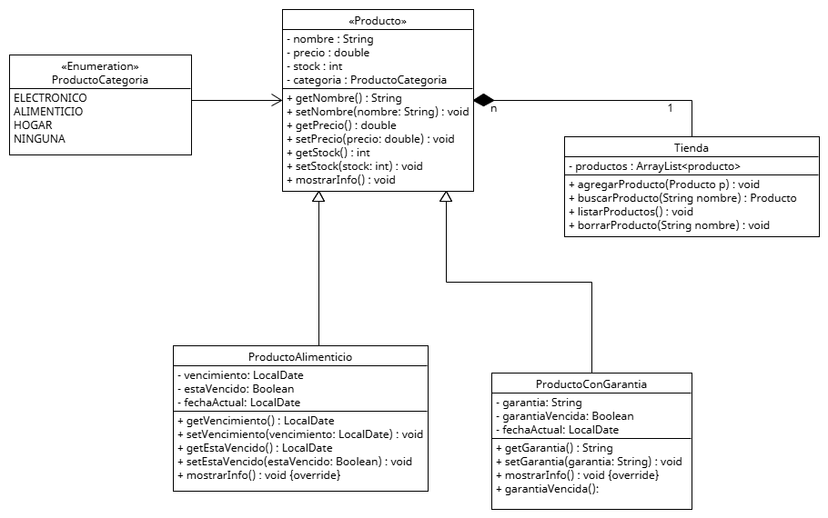

<header>
    <h1>🛒 ABM Gestor de Productos en Java</h1>
    
Proyecto de consola en Java para gestionar productos de una tienda

</header>

<section>
    <h2>📝 Descripción</h2>
    
Proyecto <strong>sistema ABM (Alta, Baja, Modificación) de productos</strong> desarrollado en Java.
        Permite agregar, listar, buscar y borrar productos de una tienda de forma sencilla.

</section>

<section>
    <h2>📂 Estructura del proyecto</h2>
    <pre>
abm_gestion_productos/
│
├─ src/        → Código fuente (.java)
├─ bin/        → Archivos compilados (.class)
├─ README.md   → Este archivo
└─ .git/       → Carpeta de Git
    </pre>
</section>

<section>
    <h2>🚀 Tecnologías utilizadas</h2>
    <ul>
        <li>Java 17</li>
        <li>Git / GitHub</li>
        <li>Programación Orientada a Objetos (POO)</li>
    </ul>
</section>

<section>
    <h2>📥 Clonar el proyecto</h2>
    
Para clonar este repositorio y probar el proyecto en tu Pc:

    <pre>
# Clonar el repo desde GitHub
git clone https://github.com/marianoborgini1/ABM_Gestor_Productos.git

# Entrar a la carpeta del proyecto
cd ABM_Gestor_Produc/abm_gestion_productos
    </pre>
</section>

<section>
    <h2>⚙️ Cómo ejecutar</h2>
    <pre>
# Abrir PowerShell o CMD en la carpeta raíz del proyecto
cd "C:\Programacion\sistema_abm_productos\abm_gestion_productos"

# Compilar archivos Java
javac src/*.java -d bin

# Ejecutar el programa
java -cp bin App
    </pre>
</section>

<section>
    <h2>📌 Funcionalidades principales</h2>
    <table>
        <tr>
            <th>Función</th>
            <th>Descripción</th>
        </tr>
        <tr>
            <td>Agregar</td>
            <td>Permite ingresar un nuevo producto</td>
        </tr>
        <tr>
            <td>Listar</td>
            <td>Muestra todos los productos existentes</td>
        </tr>
        <tr>
            <td>Buscar</td>
            <td>Busca un producto por nombre</td>
        </tr>
        <tr>
            <td>Borrar</td>
            <td>Elimina un producto por nombre</td>
        </tr>
        <tr>
            <td>Productos precargados</td>
            <td>Para probar la app sin agregar nada</td>
        </tr>
    </table>
</section>

<section>
    <h2> 🧩 Diagrama de clases</h2>
    
    
Reemplaza esta imagen por un screenshot de tu consola mostrando la app funcionando.

</section>

<section>
    <h2>💻 Autor</h2>
    
<strong>Mariano Borgini</strong> – Estudiante de Desarrollo de Software

    <a href="https://github.com/marianoborgini1" class="button">Mi GitHub</a>
</section>

<section>
    <h2>📜 Licencia</h2>
    
Este proyecto está bajo la licencia MIT.

</section>

<footer>
    &copy; 2025 Mariano Borgini
</footer>

</body>
</html>
